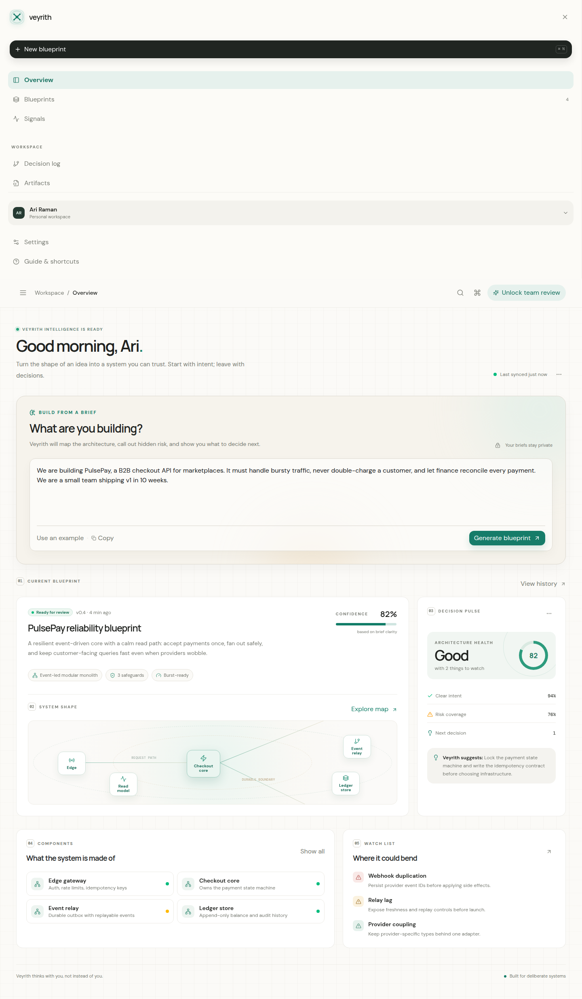

# Veyrith

**Architecture, made legible.**

Veyrith is an AI-native architecture decision studio for turning product intent into a system blueprint that humans can review, question, and evolve. It emphasizes explicit assumptions, failure modes, system shape, and the next decision—not generic chat.

> Veyrith is an early product release. It is designed to be useful and inspectable, but generated architecture remains advisory and should be reviewed by qualified engineers.



The repository also includes a mobile viewport capture and the original scalable signal-knot mark in [`docs/assets.md`](docs/assets.md).

## What is included

- A responsive, editorial workspace for architecture exploration.
- A structured AI blueprint generator with server-side credentials.
- Explicit assumptions, architecture components, confidence, risks, and next decision.
- A safe seeded blueprint fallback when the AI provider is unavailable.
- A visual system-shape preview and decision pulse.
- Type-safe tRPC procedures, Zod validation, and focused Vitest coverage.
- Contributor-ready documentation, security guidance, and CI configuration.

## Stack

| Layer      | Technology                                        |
| ---------- | ------------------------------------------------- |
| UI         | React 19, Vite, Tailwind CSS 4                    |
| API        | Express, tRPC 11                                  |
| Validation | TypeScript, Zod                                   |
| Data       | Drizzle ORM, MySQL/TiDB                           |
| AI         | Veyrith server-side LLM gateway, server-side only |
| Testing    | Vitest                                            |
| Runtime    | Node.js 22+, pnpm                                 |

## Local development

### Prerequisites

- Node.js 22 or newer
- pnpm 10
- A configured database when using persistence
- The runtime environment variables described by the WebDev deployment environment when using the built-in AI gateway

### Install and run

```bash
pnpm install
pnpm dev
```

### Verification

```bash
pnpm check
pnpm test
pnpm build
pnpm format:check
```

## Environment and security

Never commit `.env` files, API keys, session secrets, or database credentials. AI requests are intentionally performed on the server; do not move the built-in LLM credential into browser code. Set the server-only `VEYRITH_API_KEYS` (comma-separated for zero-downtime rotation) to enable authenticated `POST /api/v1/blueprints` access for external services. Use `VEYRITH_API_RATE_LIMIT` to tune the per-key minute limit. See [docs/api.md](docs/api.md) and [SECURITY.md](SECURITY.md) for operations and reporting guidance.

## Integrations

The production application stays in TypeScript because it matches the current React, tRPC, and WebDev runtime. Go, Python, C#, and PHP examples are included in [`docs/integrations.md`](docs/integrations.md) for teams that want to place language-specific services around Veyrith without forcing a low-value rewrite of the core product.

## Contribution

Veyrith welcomes thoughtful contributions. Start with [CONTRIBUTING.md](CONTRIBUTING.md), open an issue for substantial changes, and keep pull requests narrow, tested, and easy to review.

## License

Veyrith is released under the [MIT License](LICENSE).
